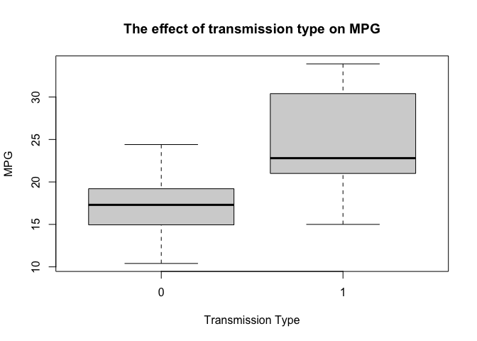
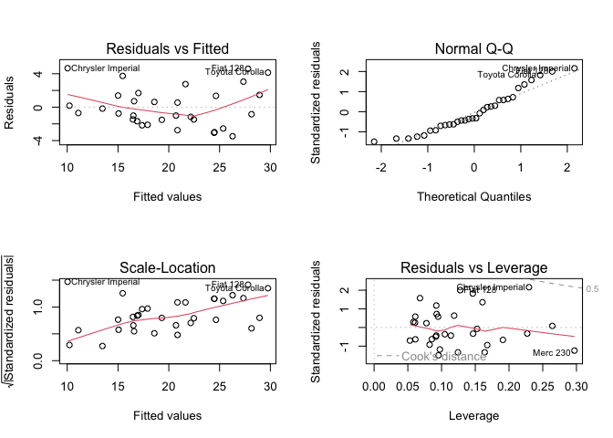

# Regression Models Course Project

## Executive Summary

This report explored the following questions about cars: <br>
1. Is an automatic or manual better for MPG? <br>
2. Quantify the MPG difference between automatic and manual transmissions. 

Exploratory data analysis, statistical interference and regression analysis were performed. <br>

The results of a t-test indicate that manual cars are better in terms of miles per gallon (mpg) compared to automatic cars, with a mean difference of 7.245 (p < 0.05). <br>
The subsequent regression model, which controlled for the effects of 1/4 mile time (qsec) and weight (wt), confirmed that manual transmission cars have an average of 2.9 more miles per gallon compared to cars with automatic transmission.


## Data 
The data used in this analysis is the mtcars dataset which is extracted from the 1974 Motor Trend US magazine. The dataset includes fuel consumption and 10 aspects of automobile design and performance for 32 automobiles (1973-74 models).<br>

The data and the appropriate packages are loaded.


```r
library(dplyr)
library(car)
```


```r
data(mtcars)
head(mtcars)
```

```
##                    mpg cyl disp  hp drat    wt  qsec vs am gear carb
## Mazda RX4         21.0   6  160 110 3.90 2.620 16.46  0  1    4    4
## Mazda RX4 Wag     21.0   6  160 110 3.90 2.875 17.02  0  1    4    4
## Datsun 710        22.8   4  108  93 3.85 2.320 18.61  1  1    4    1
## Hornet 4 Drive    21.4   6  258 110 3.08 3.215 19.44  1  0    3    1
## Hornet Sportabout 18.7   8  360 175 3.15 3.440 17.02  0  0    3    2
## Valiant           18.1   6  225 105 2.76 3.460 20.22  1  0    3    1
```
The variable names are as follows: <br>
mpg: Miles/(US) gallon, cyl: number of cylinders, disp: Displacement (cu.in.), hp: Gross horsepower, drat: Rear axle ratio, wt: Weight (1000 lbs), qsec: 1/4 mile time, vs: Engine (0 = V-shaped, 1 = straight), am: Transmission (0 = automatic, 1 = manual), gear: Number of forward gears, carb: Number of carburetors.

# Exploratory Data Analysis

In order to evaluate the impact of transmission type (manual or automatic) on miles per gallon (mpg), an exploratory data analysis was conducted. <br>

First, the mean and standard deviation of mpg were calculated for both manual and automatic transmission. The calculation was done using the following code: <br>


```r
mtcars %>% select(mpg, am) %>% group_by(am) %>% summarise(mean(mpg), sd(mpg))
```

```
## # A tibble: 2 × 3
##      am `mean(mpg)` `sd(mpg)`
##   <dbl>       <dbl>     <dbl>
## 1     0        17.1      3.83
## 2     1        24.4      6.17
```

Next, a boxplot was created to visualize the distribution of mpg for both transmission types. The code for the boxplot is as follows: 

```r
boxplot(mpg~am, data = mtcars, main = "The effect of transmission type on MPG", xlab = "Transmission Type", ylab="MPG")
```

<!-- -->

The exploratory data analysis suggests that manual transmission has a higher mean mpg (24.4) compared to automatic transmission (17.1).

# Statistical Interference

To confirm whether manual transmission has a significantly higher mpg than automatic, a t-test was performed.


```r
t.test(mpg~am, data = mtcars, alternative = c("less"))
```

```
## 
## 	Welch Two Sample t-test
## 
## data:  mpg by am
## t = -3.7671, df = 18.332, p-value = 0.0006868
## alternative hypothesis: true difference in means between group 0 and group 1 is less than 0
## 95 percent confidence interval:
##       -Inf -3.913256
## sample estimates:
## mean in group 0 mean in group 1 
##        17.14737        24.39231
```
This t-test shows that manual cars have a significantly higher MPG than automatic, 7.245 (p < 0.05).

# Regression Models

A regression model was created to assess the relationship between miles per gallon (mpg) and transmission type (am) using the mtcars dataset. The model was fit using the lm function in R as follows:


```r
fit <- lm(mpg~am, mtcars)
summary(fit)
```

```
## 
## Call:
## lm(formula = mpg ~ am, data = mtcars)
## 
## Residuals:
##     Min      1Q  Median      3Q     Max 
## -9.3923 -3.0923 -0.2974  3.2439  9.5077 
## 
## Coefficients:
##             Estimate Std. Error t value Pr(>|t|)    
## (Intercept)   17.147      1.125  15.247 1.13e-15 ***
## am             7.245      1.764   4.106 0.000285 ***
## ---
## Signif. codes:  0 '***' 0.001 '**' 0.01 '*' 0.05 '.' 0.1 ' ' 1
## 
## Residual standard error: 4.902 on 30 degrees of freedom
## Multiple R-squared:  0.3598,	Adjusted R-squared:  0.3385 
## F-statistic: 16.86 on 1 and 30 DF,  p-value: 0.000285
```

The low R squared value of the model (0.400) suggests that there may be other confounding variables at play. To account for these variables, a step-wise regression was performed using the step function as shown below:


```r
fit2 <- lm(mpg~., mtcars)
model <- step(fit2, direction = c("backward"))
```


```r
summary(model)
```

```
## 
## Call:
## lm(formula = mpg ~ wt + qsec + am, data = mtcars)
## 
## Residuals:
##     Min      1Q  Median      3Q     Max 
## -3.4811 -1.5555 -0.7257  1.4110  4.6610 
## 
## Coefficients:
##             Estimate Std. Error t value Pr(>|t|)    
## (Intercept)   9.6178     6.9596   1.382 0.177915    
## wt           -3.9165     0.7112  -5.507 6.95e-06 ***
## qsec          1.2259     0.2887   4.247 0.000216 ***
## am            2.9358     1.4109   2.081 0.046716 *  
## ---
## Signif. codes:  0 '***' 0.001 '**' 0.01 '*' 0.05 '.' 0.1 ' ' 1
## 
## Residual standard error: 2.459 on 28 degrees of freedom
## Multiple R-squared:  0.8497,	Adjusted R-squared:  0.8336 
## F-statistic: 52.75 on 3 and 28 DF,  p-value: 1.21e-11
```

The stepwise regression included weight (wt) and 1/4 mile time (qsec) as new variables in the model, which increased the R squared to 0.845. The model suggests that, after controlling for weight and 1/4 mile time, manual transmission cars tend to have an average of 2.9 more miles per gallon compared to cars with automatic transmission.

The fit of the model was further analyzed using residual plots obtained from the plot function as shown below: <br>


```r
par(mfrow = c(2,2))
plot(model)
```

<!-- -->
<br>These plots showed that the residuals were not correlated with the predicted values, indicating that the assumption of homoscedacity was met.<br>

The residual plots showed that the Cadillac Fleetwood, Lincoln Continental, and Chryslyer Imperial car models could potentially be outliers. The influence.measures() function could be used to further quantify this. <br>


The absence of correlation between the residuals and the predictor, as indicated by the low value obtained from the following code, suggests that the model has captured the relevant predictors:


```r
cor(model$residuals, mtcars$am)
```

```
## [1] 5.908709e-18
```
A Shapiro-Wilk test was performed to check if the residuals followed a normal distribution:


```r
shapiro.test(model$residuals)
```

```
## 
## 	Shapiro-Wilk normality test
## 
## data:  model$residuals
## W = 0.9411, p-value = 0.08043
```
While the p-value is low, it is still above 0.05, so the model adheres to the assumption of residual normality. The low values of the mean of the residuals and the mean squared error (MSE) obtained from the following code further indicate that the model is a good fit for the data:


```r
mean(model$residuals)
```

```
## [1] 5.20417e-17
```

```r
mean(model$residuals)^2
```

```
## [1] 2.708339e-33
```
The vif function from the car library was used to check for collinearity among predictors, which showed low vif values, indicating that the predictors are not correlated with each other:


```r
library(car)
vif(model)
```

```
##       wt     qsec       am 
## 2.482952 1.364339 2.541437
```

Some limitations of our model include the fact that step wise regression was used, as this can introduce bias depending on the order of variables in the dataset. Different forms of regression could be used such as LASSO. 


